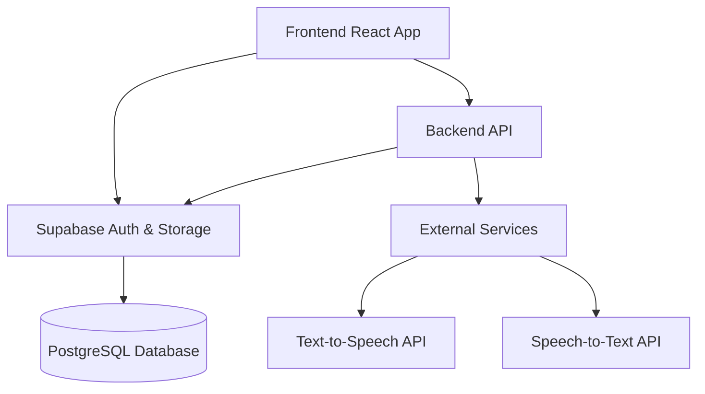
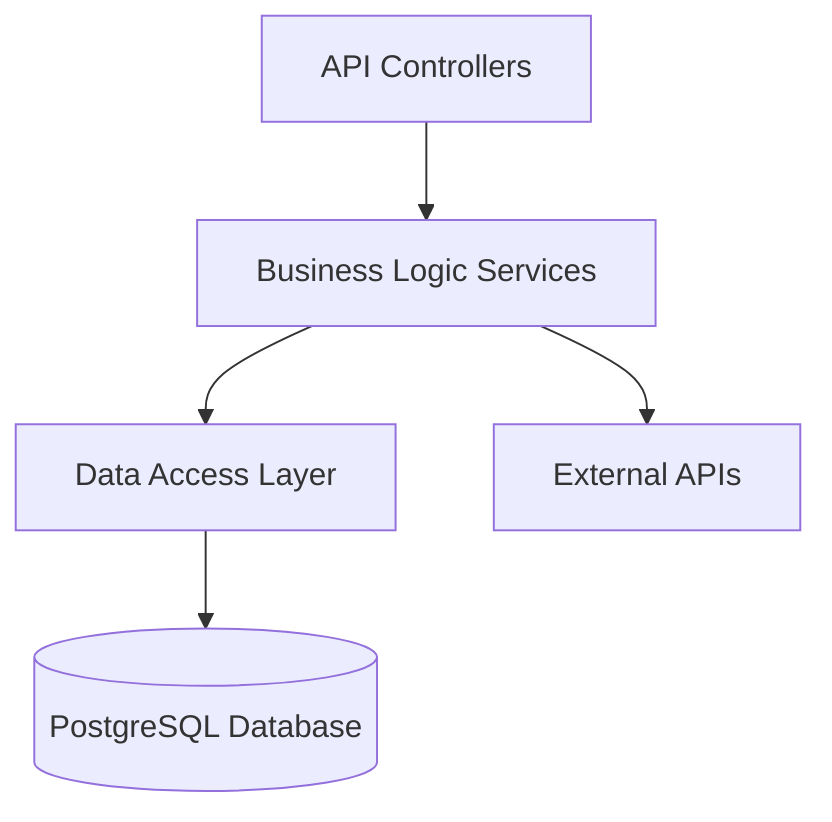
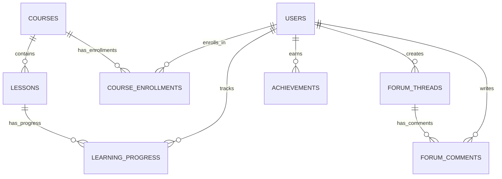

## 1. Architecture Design


## 2. Technology Description
- Frontend: React@18 + TypeScript + Tailwind CSS@3 + Vite
- Initialization Tool: vite-init
- Backend: Express@4 + TypeScript
- Database: Supabase (PostgreSQL)
- Authentication: Supabase Auth
- Storage: Supabase Storage (for audio files, user avatars)
- External APIs: Text-to-Speech and Speech-to-Text services for language learning

## 3. Route Definitions
| Route | Purpose |
|-------|---------|
| / | Home page with language selection and course categories |
| /courses | Course listing page |
| /courses/:id | Course details page |
| /learn/:courseId/:lessonId | Learning module page |
| /profile | User profile page with learning statistics |
| /community | Community forum page |
| /auth/login | Login page |
| /auth/register | Registration page |

## 4. API Definitions
### 4.1 Authentication APIs
| Endpoint | Method | Description | Request Body | Response |
|----------|--------|-------------|--------------|----------|
| /api/auth/register | POST | Register new user | { email, password, name } | { user, token } |
| /api/auth/login | POST | User login | { email, password } | { user, token } |
| /api/auth/logout | POST | User logout | N/A | { success: true } |

### 4.2 Course APIs
| Endpoint | Method | Description | Request Body | Response |
|----------|--------|-------------|--------------|----------|
| /api/courses | GET | Get all courses | N/A | [Course] |
| /api/courses/:id | GET | Get course details | N/A | Course |
| /api/courses/:id/lessons | GET | Get course lessons | N/A | [Lesson] |
| /api/courses/:id/enroll | POST | Enroll in course | N/A | { success: true } |

### 4.3 Learning APIs
| Endpoint | Method | Description | Request Body | Response |
|----------|--------|-------------|--------------|----------|
| /api/learning/progress | GET | Get user learning progress | N/A | { courses: [CourseProgress] } |
| /api/learning/progress | POST | Update learning progress | { courseId, lessonId, completed } | { success: true } |
| /api/learning/recommendations | GET | Get personalized recommendations | N/A | [Course] |

### 4.4 Community APIs
| Endpoint | Method | Description | Request Body | Response |
|----------|--------|-------------|--------------|----------|
| /api/community/threads | GET | Get forum threads | N/A | [Thread] |
| /api/community/threads | POST | Create new thread | { title, content, language } | Thread |
| /api/community/threads/:id | GET | Get thread details | N/A | Thread |
| /api/community/threads/:id/comments | POST | Add comment to thread | { content } | Comment |

### 4.5 User APIs
| Endpoint | Method | Description | Request Body | Response |
|----------|--------|-------------|--------------|----------|
| /api/users/profile | GET | Get user profile | N/A | UserProfile |
| /api/users/profile | PUT | Update user profile | { name, avatar, languagePreference } | UserProfile |
| /api/users/achievements | GET | Get user achievements | N/A | [Achievement] |

## 5. Server Architecture Diagram


## 6. Data Model
### 6.1 Data Model Definition


### 6.2 Data Definition Language
```sql
-- Users table
CREATE TABLE users (
    id UUID PRIMARY KEY DEFAULT gen_random_uuid(),
    email VARCHAR(255) UNIQUE NOT NULL,
    name VARCHAR(255) NOT NULL,
    avatar VARCHAR(255),
    language_preference VARCHAR(10),
    is_premium BOOLEAN DEFAULT false,
    created_at TIMESTAMP DEFAULT NOW(),
    updated_at TIMESTAMP DEFAULT NOW()
);

-- Courses table
CREATE TABLE courses (
    id UUID PRIMARY KEY DEFAULT gen_random_uuid(),
    title VARCHAR(255) NOT NULL,
    description TEXT,
    language VARCHAR(10) NOT NULL,
    level VARCHAR(20) NOT NULL,
    duration INT, -- in hours
    image_url VARCHAR(255),
    is_premium BOOLEAN DEFAULT false,
    created_at TIMESTAMP DEFAULT NOW(),
    updated_at TIMESTAMP DEFAULT NOW()
);

-- Lessons table
CREATE TABLE lessons (
    id UUID PRIMARY KEY DEFAULT gen_random_uuid(),
    course_id UUID REFERENCES courses(id),
    title VARCHAR(255) NOT NULL,
    description TEXT,
    order_index INT NOT NULL,
    content JSONB, -- lesson content in JSON format
    created_at TIMESTAMP DEFAULT NOW(),
    updated_at TIMESTAMP DEFAULT NOW()
);

-- Course enrollments table
CREATE TABLE course_enrollments (
    id UUID PRIMARY KEY DEFAULT gen_random_uuid(),
    user_id UUID REFERENCES users(id),
    course_id UUID REFERENCES courses(id),
    enrolled_at TIMESTAMP DEFAULT NOW(),
    UNIQUE(user_id, course_id)
);

-- Learning progress table
CREATE TABLE learning_progress (
    id UUID PRIMARY KEY DEFAULT gen_random_uuid(),
    user_id UUID REFERENCES users(id),
    course_id UUID REFERENCES courses(id),
    lesson_id UUID REFERENCES lessons(id),
    completed BOOLEAN DEFAULT false,
    completed_at TIMESTAMP,
    progress_percentage INT DEFAULT 0,
    updated_at TIMESTAMP DEFAULT NOW(),
    UNIQUE(user_id, lesson_id)
);

-- Achievements table
CREATE TABLE achievements (
    id UUID PRIMARY KEY DEFAULT gen_random_uuid(),
    name VARCHAR(255) NOT NULL,
    description TEXT,
    icon_url VARCHAR(255),
    requirement JSONB -- achievement requirements in JSON format
);

-- User achievements table
CREATE TABLE user_achievements (
    id UUID PRIMARY KEY DEFAULT gen_random_uuid(),
    user_id UUID REFERENCES users(id),
    achievement_id UUID REFERENCES achievements(id),
    earned_at TIMESTAMP DEFAULT NOW(),
    UNIQUE(user_id, achievement_id)
);

-- Forum threads table
CREATE TABLE forum_threads (
    id UUID PRIMARY KEY DEFAULT gen_random_uuid(),
    user_id UUID REFERENCES users(id),
    title VARCHAR(255) NOT NULL,
    content TEXT NOT NULL,
    language VARCHAR(10) NOT NULL,
    created_at TIMESTAMP DEFAULT NOW(),
    updated_at TIMESTAMP DEFAULT NOW(),
    views INT DEFAULT 0,
    replies INT DEFAULT 0
);

-- Forum comments table
CREATE TABLE forum_comments (
    id UUID PRIMARY KEY DEFAULT gen_random_uuid(),
    thread_id UUID REFERENCES forum_threads(id),
    user_id UUID REFERENCES users(id),
    content TEXT NOT NULL,
    created_at TIMESTAMP DEFAULT NOW(),
    updated_at TIMESTAMP DEFAULT NOW()
);

-- Initial data for achievements
INSERT INTO achievements (name, description, icon_url, requirement) VALUES
('First Lesson', 'Complete your first lesson', 'badge-first-lesson.svg', '{"type": "lesson_completed", "count": 1}'),
('Language Explorer', 'Start learning a new language', 'badge-language-explorer.svg', '{"type": "language_started", "count": 2}'),
('Consistent Learner', 'Learn for 7 days in a row', 'badge-consistent-learner.svg', '{"type": "streak", "days": 7}'),
('Vocabulary Master', 'Learn 100 new words', 'badge-vocabulary-master.svg', '{"type": "words_learned", "count": 100}'),
('Community Contributor', 'Post your first forum thread', 'badge-community-contributor.svg', '{"type": "forum_posts", "count": 1}');

-- Initial data for courses
INSERT INTO courses (title, description, language, level, duration, image_url, is_premium) VALUES
('English for Beginners', 'Start your English learning journey with basic vocabulary and grammar', 'en', 'beginner', 20, 'https://trae-api-cn.mchost.guru/api/ide/v1/text_to_image?prompt=english%20language%20learning%20classroom%20scene&image_size=landscape_16_9', false),
('Japanese Hiragana & Katakana', 'Master the Japanese writing system', 'ja', 'beginner', 15, 'https://trae-api-cn.mchost.guru/api/ide/v1/text_to_image?prompt=japanese%20hiragana%20katakana%20learning&image_size=landscape_16_9', false),
('Korean Basics', 'Learn Korean fundamentals including Hangul', 'ko', 'beginner', 18, 'https://trae-api-cn.mchost.guru/api/ide/v1/text_to_image?prompt=korean%20language%20learning%20hangul&image_size=landscape_16_9', false),
('English Intermediate', 'Build on your English skills with more complex grammar and vocabulary', 'en', 'intermediate', 30, 'https://trae-api-cn.mchost.guru/api/ide/v1/text_to_image?prompt=intermediate%20english%20learning%20advanced%20class&image_size=landscape_16_9', true),
('Japanese Conversation', 'Practice everyday Japanese conversations', 'ja', 'intermediate', 25, 'https://trae-api-cn.mchost.guru/api/ide/v1/text_to_image?prompt=japanese%20conversation%20practice%20dialogue&image_size=landscape_16_9', true);

-- Grant permissions
GRANT SELECT ON ALL TABLES TO anon;
GRANT ALL PRIVILEGES ON ALL TABLES TO authenticated;
```