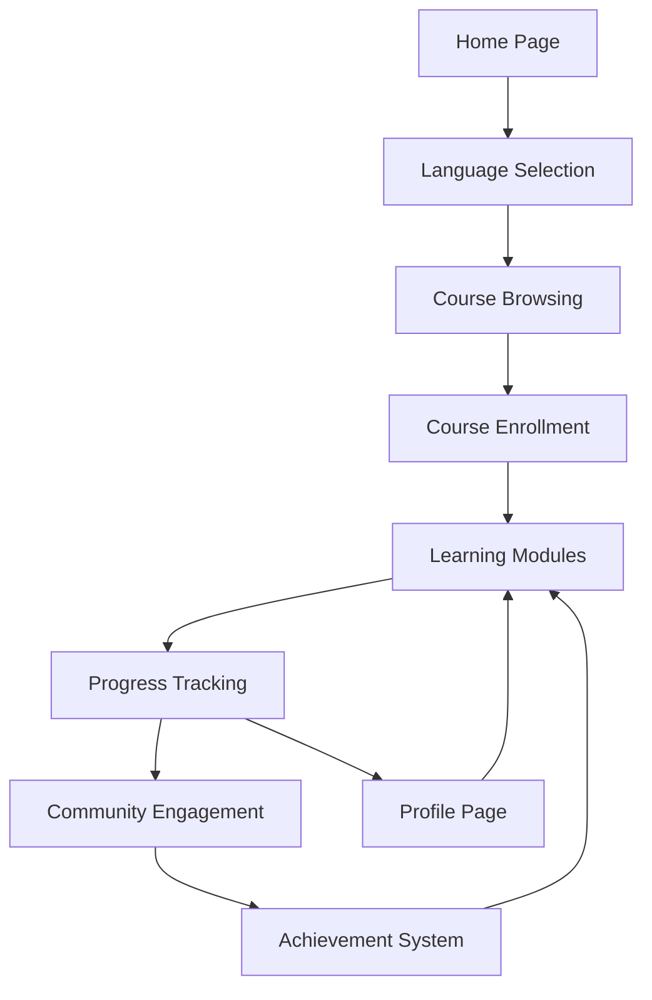

## 1. Product Overview
多语种在线教育平台，提供沉浸式语言学习体验，支持英语、日语、韩语等主流语言。
- 解决用户语言学习缺乏系统化、互动性差的问题，为学习者提供全面的语言学习工具。
- 目标用户为语言学习者，市场价值在于提供个性化、高效的语言学习解决方案。

## 2. Core Features

### 2.1 User Roles
| Role | Registration Method | Core Permissions |
|------|---------------------|------------------|
| Normal User | Email registration | Access all learning features, track progress, join community |
| Premium User | Email registration + Payment | Access all features + premium content |

### 2.2 Feature Module
1. **Home page**: hero section, language selection, course categories, featured courses
2. **Course page**: course details, lesson list, progress tracking
3. **Learning module**: vocabulary practice, grammar exercises, speaking practice, listening training
4. **Profile page**: user information, learning statistics, achievement badges
5. **Community page**: discussion forum, study groups, peer feedback

### 2.3 Page Details
| Page Name | Module Name | Feature description |
|-----------|-------------|---------------------|
| Home page | Hero section | Dynamic language learning scenarios, language selector, call-to-action buttons |
| Home page | Course categories | Filter courses by language and level, popular courses display |
| Course page | Course details | Course description, level information, estimated completion time |
| Course page | Lesson list | Structured lesson progression, completed lessons marked |
| Learning module | Vocabulary practice | Flashcards, spaced repetition, pronunciation audio |
| Learning module | Grammar exercises | Interactive quizzes, instant feedback, explanation resources |
| Learning module | Speaking practice | Voice recording, pronunciation evaluation, comparison with native speakers |
| Learning module | Listening training | Audio clips, comprehension questions, speed adjustment |
| Profile page | Learning statistics | Progress charts, time spent, achievements unlocked |
| Profile page | Achievement badges | Visual representation of milestones, rewards for consistent learning |
| Community page | Discussion forum | Topic-based threads, language-specific channels, expert answers |
| Community page | Study groups | Create or join groups, shared learning goals, group activities |

## 3. Core Process
### Main User Flow
1. User registers/login to the platform
2. Selects target language and proficiency level
3. Browses and enrolls in courses
4. Engages with interactive learning modules
5. Tracks progress and receives personalized recommendations
6. Participates in community activities and earns achievements

## 4. User Interface Design
### 4.1 Design Style
- Primary color: #4361ee (blue)
- Secondary color: #3f37c9 (dark blue)
- Accent color: #4895ef (light blue)
- Button style: Rounded corners (8px), subtle shadow, hover effects
- Font: Inter (sans-serif) for body text, Poppins (sans-serif) for headings
- Font sizes: 16px (body), 24px (h2), 32px (h1)
- Layout style: Card-based design, clean white space, responsive grid
- Icon style: Minimalist, line-based icons with subtle animations

### 4.2 Page Design Overview
| Page Name | Module Name | UI Elements |
|-----------|-------------|-------------|
| Home page | Hero section | Full-width background with language learning imagery, animated language selection carousel, prominent CTA buttons with hover effects |
| Home page | Course categories | Grid of course cards with level indicators, language tags, progress bars, and subtle hover animations |
| Course page | Course details | Header with course banner, progress circle indicator, tabbed content layout for lessons and resources |
| Learning module | Vocabulary practice | Interactive flashcards with flip animations, pronunciation audio player, progress indicators, and reward animations |
| Profile page | Learning statistics | Interactive charts (line and bar graphs), achievement badge grid, time spent visualization with smooth animations |
| Community page | Discussion forum | Threaded conversation layout, language filter tabs, user avatars, and engagement metrics with hover interactions |

### 4.3 Responsiveness
- Desktop-first design with mobile-adaptive layouts
- Breakpoints: 360px (mobile), 768px (tablet), 1200px (desktop)
- Touch optimization for mobile devices, with larger tap targets and swipe gestures
- Collapsible navigation menu for mobile, expanded sidebar for desktop

### 4.4 3D Scene Guidance
- Not applicable for this project