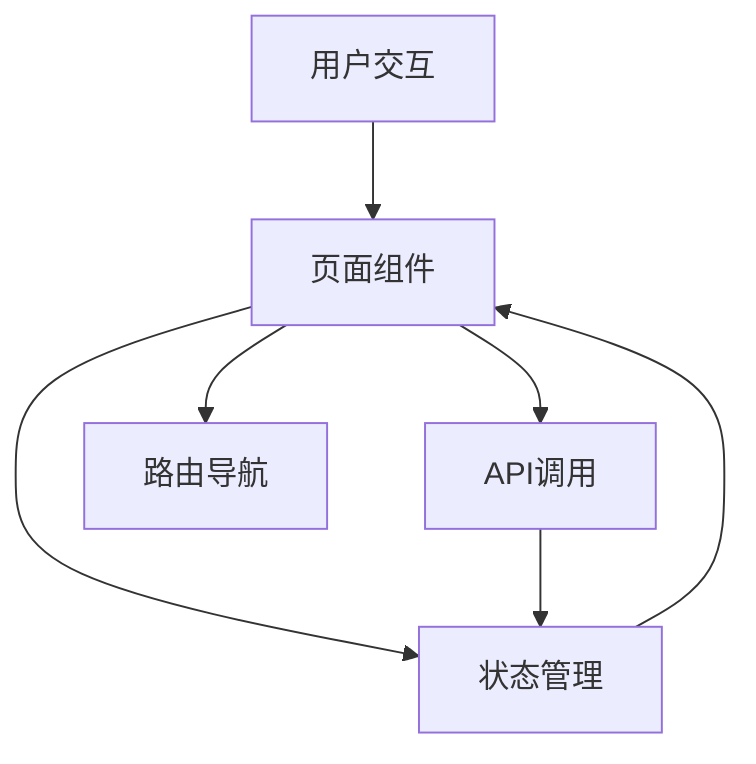

# Language Learning Platform Code Wiki

## 1. 项目概览

LinguaLearn是一个沉浸式语言学习平台，支持英语、日语和韩语的学习。平台提供结构化课程、交互式学习体验、成就系统和社区功能，帮助用户从基础到高级逐步掌握目标语言。

### 主要功能
- 多语言支持（英语、日语、韩语）
- 分级课程体系
- 交互式学习模块（词汇、语法、听力、口语）
- 用户认证系统
- 学习社区
- 深色/浅色主题切换
- 响应式设计，支持移动端和桌面端

### 技术栈
- **前端框架**: React 18.3.1
- **语言**: TypeScript
- **路由**: React Router v7
- **样式**: Tailwind CSS
- **状态管理**: Zustand
- **图标库**: Lucide React
- **构建工具**: Vite

## 2. 项目架构

### 目录结构

```
src/
├── assets/           # 静态资源
├── components/       # 可复用组件
│   ├── Empty.tsx     # 空状态组件
│   └── Layout.tsx    # 页面布局组件
├── hooks/            # 自定义钩子
│   └── useTheme.ts   # 主题管理钩子
├── lib/              # 工具库
│   └── utils.ts      # 通用工具函数
├── pages/            # 页面组件
│   ├── Community.tsx     # 社区页面
│   ├── CourseDetail.tsx  # 课程详情页
│   ├── Courses.tsx       # 课程列表页
│   ├── Home.tsx          # 首页
│   ├── LearningModule.tsx # 学习模块页
│   ├── Login.tsx         # 登录页
│   ├── Profile.tsx       # 个人资料页
│   └── Register.tsx      # 注册页
├── App.tsx           # 应用入口，路由配置
├── index.css         # 全局样式
├── main.tsx          # 主入口文件
└── vite-env.d.ts     # Vite类型声明
```

### 架构设计

LinguaLearn采用现代React应用架构，遵循以下设计原则：

1. **组件化设计**: 将UI拆分为可复用的组件，如Layout、Empty等
2. **路由管理**: 使用React Router v7实现页面导航
3. **状态管理**: 使用Zustand管理应用状态
4. **响应式设计**: 使用Tailwind CSS实现响应式布局
5. **主题切换**: 通过useTheme钩子实现深色/浅色模式

### 数据流



## 3. 核心模块

### 3.1 路由系统

路由系统使用React Router v7实现，主要路由配置在[App.tsx](file:///Users/bytedance/Desktop/language-learning-platform/src/App.tsx)中定义：

- 主路由：包含Home、Courses、CourseDetail、LearningModule、Profile、Community
- 认证路由：包含Login、Register
- 布局：使用Layout组件作为共享布局

### 3.2 主题管理

主题管理通过[useTheme](file:///Users/bytedance/Desktop/language-learning-platform/src/hooks/useTheme.ts)钩子实现：

- 支持深色/浅色模式切换
- 自动检测系统主题偏好
- 主题设置持久化到localStorage
- 提供isDark状态和toggleTheme方法

### 3.3 课程管理

课程管理模块包含：

- **课程列表** ([Courses.tsx](file:///Users/bytedance/Desktop/language-learning-platform/src/pages/Courses.tsx)): 展示所有课程，支持语言和级别筛选
- **课程详情** ([CourseDetail.tsx](file:///Users/bytedance/Desktop/language-learning-platform/src/pages/CourseDetail.tsx)): 展示课程详细信息、课程大纲和学生评价
- **学习模块** ([LearningModule.tsx](file:///Users/bytedance/Desktop/language-learning-platform/src/pages/LearningModule.tsx)): 提供交互式学习体验，包括词汇、语法、听力和口语练习

### 3.4 认证系统

认证系统包含：
- **登录页** ([Login.tsx](file:///Users/bytedance/Desktop/language-learning-platform/src/pages/Login.tsx))
- **注册页** ([Register.tsx](file:///Users/bytedance/Desktop/language-learning-platform/src/pages/Register.tsx))

### 3.5 社区功能

社区功能通过[Community.tsx](file:///Users/bytedance/Desktop/language-learning-platform/src/pages/Community.tsx)实现，允许用户与其他学习者交流。

## 4. 关键组件与函数

### 4.1 布局组件

**Layout组件** ([Layout.tsx](file:///Users/bytedance/Desktop/language-learning-platform/src/components/Layout.tsx)):

- 提供应用的整体布局结构
- 包含导航栏、移动端菜单和页脚
- 集成主题切换功能
- 使用Outlet组件渲染子路由内容

### 4.2 主题钩子

**useTheme钩子** ([useTheme.ts](file:///Users/bytedance/Desktop/language-learning-platform/src/hooks/useTheme.ts)):

- 管理应用主题状态
- 实现主题切换逻辑
- 持久化主题设置

### 4.3 学习模块

**LearningModule组件** ([LearningModule.tsx](file:///Users/bytedance/Desktop/language-learning-platform/src/pages/LearningModule.tsx)):

- 提供词汇卡片练习
- 实现语法练习题
- 支持听力练习
- 集成口语练习功能

### 4.4 课程列表

**Courses组件** ([Courses.tsx](file:///Users/bytedance/Desktop/language-learning-platform/src/pages/Courses.tsx)):

- 展示课程列表
- 实现课程筛选功能
- 支持课程搜索

### 4.5 首页

**Home组件** ([Home.tsx](file:///Users/bytedance/Desktop/language-learning-platform/src/pages/Home.tsx)):

- 展示平台特色
- 提供语言选择器
- 展示推荐课程

## 5. 数据结构

### 5.1 课程数据结构

```typescript
interface Course {
  id: string;
  title: string;
  description: string;
  language: string; // 'en', 'ja', 'ko'
  level: string; // 'beginner', 'intermediate', 'advanced'
  duration: number; // 课程时长（小时）
  image: string; // 课程封面图
  isPremium: boolean; // 是否为 premium 课程
  rating?: number; // 课程评分
  students?: number; // 学生数量
  instructor?: string; // 讲师
  lessons?: Lesson[]; // 课程章节
  requirements?: string[]; // 课程要求
  whatYouWillLearn?: string[]; // 学习目标
}

interface Lesson {
  id: string;
  title: string;
  description: string;
  duration: number; // 章节时长（分钟）
  completed: boolean; // 是否已完成
}
```

### 5.2 学习数据结构

```typescript
// 词汇卡片
interface VocabularyCard {
  word: string; // 单词
  translation: string; // 翻译
  pronunciation: string; // 发音
}

// 语法问题
interface GrammarQuestion {
  question: string; // 问题
  options: string[]; // 选项
  correctAnswer: number; // 正确答案索引
}

// 听力练习
interface ListeningExercise {
  audio: string; // 音频URL
  transcript: string; // 文本
  question: string; // 问题
  options: string[]; // 选项
  correctAnswer: number; // 正确答案索引
}

// 口语练习
interface SpeakingExercise {
  prompt: string; // 提示
  example: string; // 示例
}
```

## 6. 依赖关系

### 6.1 核心依赖

| 依赖 | 版本 | 用途 |
|------|------|------|
| react | ^18.3.1 | 前端框架 |
| react-dom | ^18.3.1 | React DOM操作 |
| react-router-dom | ^7.3.0 | 路由管理 |
| zustand | ^5.0.3 | 状态管理 |
| lucide-react | ^0.511.0 | 图标库 |
| clsx | ^2.1.1 | 类名管理 |
| tailwind-merge | ^3.0.2 | Tailwind类名合并 |

### 6.2 开发依赖

| 依赖 | 版本 | 用途 |
|------|------|------|
| typescript | ~5.8.3 | TypeScript支持 |
| vite | ^6.3.5 | 构建工具 |
| tailwindcss | ^3.4.17 | CSS框架 |
| eslint | ^9.25.0 | 代码检查 |
| @types/react | ^18.3.12 | React类型定义 |
| @types/react-dom | ^18.3.1 | React DOM类型定义 |

## 7. 项目运行

### 7.1 安装依赖

```bash
npm install
```

### 7.2 开发模式

```bash
npm run dev
```

开发服务器将在 `http://localhost:5173` 启动。

### 7.3 构建项目

```bash
npm run build
```

构建产物将生成在 `dist` 目录中。

### 7.4 预览构建

```bash
npm run preview
```

### 7.5 类型检查

```bash
npm run check
```

### 7.6 代码检查

```bash
npm run lint
```

## 8. 功能亮点

### 8.1 交互式学习体验

- **词汇卡片**：翻转卡片学习单词和翻译
- **语法练习**：选择题形式的语法练习
- **听力练习**：音频播放和理解测试
- **口语练习**：录音和反馈功能

### 8.2 响应式设计

- 适配桌面端、平板和移动设备
- 移动端优化的导航菜单
- 响应式布局和组件

### 8.3 主题系统

- 深色/浅色模式切换
- 自动检测系统主题
- 主题设置持久化

### 8.4 课程管理

- 多语言课程支持
- 分级课程体系
- 详细的课程信息和大纲

## 9. 未来扩展

- **用户进度跟踪**：记录学习进度和成就
- **社交功能**：添加好友、组队学习
- **内容扩展**：增加更多语言和课程
- **个性化推荐**：基于用户学习历史推荐课程
- **API集成**：连接后端服务，实现数据持久化
- **测试系统**：添加单元测试和集成测试

## 10. 总结

LinguaLearn是一个功能完整、用户友好的语言学习平台，采用现代前端技术栈构建。平台提供了丰富的学习资源和交互式学习体验，支持多语言学习和个性化学习路径。通过模块化的代码结构和清晰的架构设计，项目具有良好的可维护性和扩展性，为未来的功能迭代和性能优化奠定了坚实基础。

---

**注意**：本项目目前使用模拟数据进行展示，实际部署时需要连接后端API以实现完整功能。